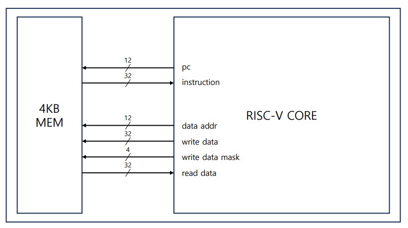
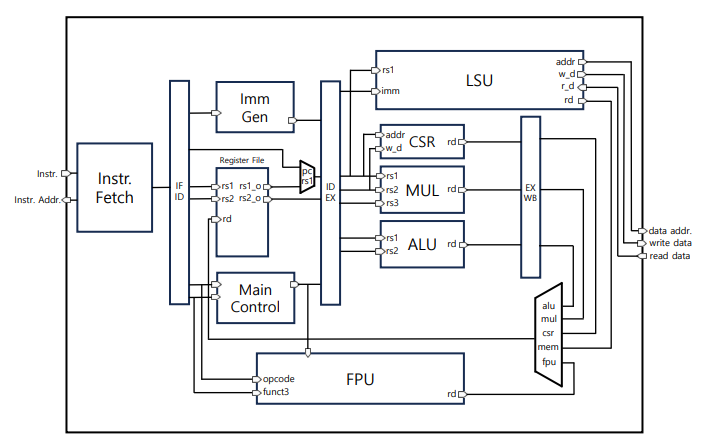

# 32-bit RISC-V CORE

4-stage, in-order core which implements the 32-bit RISC-V instruction set. 
- [x] Base Instruction (RV32I)
- [x] Zicsr Extenstion
- [x] M Extension
- [x] F Extension

### Schematic
<p align="center">



</p>

# Quick setup

The following instructions will allow you to compile and run an icarus verilog model of the core within the Cocotb testbench `sim/test_core.py`.

1. Checkout the repository
```sh
git clone https://github.com/jypark1257/riscv_core.git
```

2. Install the GNU Toolchain [riscv-gnu-toolchain](https://github.com/riscv-collab/riscv-gnu-toolchain)
```sh
git clone https://github.com/riscv-collab/riscv-gnu-toolchain.git --recursive
cd riscv-gnu-toolchain
./configure --prefix=/opt/riscv
make
```

3. Install the sifive [elf2hex](https://github.com/sifive/elf2hex.git)
```sh
git clone git://github.com/sifive/elf2hex.git
cd elf2hex
autoreconf -i
./configure --target=riscv64-unknown-elf
make
make install
```

4. Install the testbench environment [cocotb](https://docs.cocotb.org/en/stable/install.html)
```sh
sudo apt-get install make python3 python3-pip
pip install cocotb
```

# Running Assembly Tests

Assembly tests are done by using test programs from [riscv-tests](https://github.com/riscv-software-src/riscv-tests/tree/master/isa) .

1. Compile test programs using Makefile `software/asm_tests/Makefile`.
    * To compile a specific extension test program, use the `EXTENT` variable.
2. Run cocotb testbench model in `sim/asm_sim/test_asm.py`.

Here is how you can test rv32imf assembly test with the cocotb testbench: 

```sh
cd software/asm_test

# Compile test programs using Makefile
# default test extension = rv32i
make EXTENT=rv32ui
make EXTENT=rv32um
make EXTENT=rv32uf

cd ../../sim/asm_sim

make
```

# Running simulations

Simulating the core is done by using cocotb based testbench `sim/core_sim/test_core.py`.

1. Compile your program using Makefile `software/Makefile.gcc.in`.
    * The skeleton program is included in `software/test`.
2. Run cocotb testbench model in `sim/core_sim/test_core.py`.

Here is how you can run the `software/test/test.c` C program with the cocotb testbench: 

```sh
cd software/test

# Compile C program using Makefile
# compiled hex will be automatically initiliazed in the memory of the core
make

cd ../../sim/core_sim

# Make cocotb testbench model and generate waveform dump file
# the fst dump file can be found in ./sim_build/core_top.fst
make WAVES=1

# Check waveform
gtkwave ./sim_build/core_top.fst
```